# Input/Output Classification in an SRH Chatbot
# Planned Parenthood Federation: PPFA 1C
Break Through Tech AI Studio Final Project (Fall 2025)

---

## 👥 **Team Members**

| Name                       | GitHub Handle | Contribution                                                             |
|----------------------------|---------------------|--------------------------------------------------------------------------|
| Caitlyn Chau            | @caichau | Exploratory Data Analysis (EDA), feature engineering, preprocessing, SVC training/validation/evaluation, hyperparameter tuning                           |
| Lahari Yallapragada | @laharily          | Exploratory Data Analysis (EDA), feature engineering, preprocessing, GBDT training/validation/evaluation, hyperparameter tuning                         |
| Kelly Lwin                 | @phyulwin       | Exploratory Data Analysis (EDA), feature engineering, preprocessing, Random Forest training/validation/evaluation, hyperparameter tuning           |
| Cali Kuang               | @calik2          | Exploratory Data Analysis (EDA), feature engineering, preprocessing, Logistic Regression/Decision Trees training/validation/evaluation, hyperparameter tuning            								    |

---

## 🎯 **Project Highlights**

- Developed multiple supervised machine learning classifiers to evaluate the efficacy of PPFA’s sexual and reproductive health chatbot, Roo. 
- Applied natural language processing techniques in our data processing pipeline, such as TF-IDF and lemmatization, to extract meaningful information from our text data. 
- Implemented Logistic Regression, Decision Tree, Random Forest, Gradient Boosted Decision Trees (GBDT), and Support Vector Classifier (SVC) models, training them on real-life chatbot data provided by PPFA, which includes the user’s prompt and Roo’s response. 
- Achieved up to 85% testing accuracy, recall, and F1 scores, demonstrating that even simple models such as decision trees are effective in evaluating the performance of the chatbot. 
- Generated actionable insights highlighting scenarios where Roo struggles, and human educators may be better suited to assist users.

---

## 👩🏽‍💻 **Setup and Installation**

Repository link: https://github.com/phyulwin/btt-ai-studio-2025-ppfa-1c.git

### Clone the repository
- Make sure Git is installed.
- Run `git clone https://github.com/phyulwin/btt-ai-studio-2025-ppfa-1c.git`.
- Change directories with `cd ai-studio-2025-1c`.

### Environment and dependencies
- Install Docker Desktop using default settings.
- Validate Docker is running before proceeding.
- From the repository root, execute `docker-compose up`.

### Launching Jupyter
- Wait for the container to finish initializing.
- Copy the `http://127.0.0.1:8888/...` URL from the terminal.
- Open the link in a web browser to access Jupyter Lab.

### Data access and credentials
- Obtain `credential.json` from the project administrators.
- Place the file in the repository root directory.
- Exclude this file from version control at all times.

### Running notebooks and scripts
- Open notebooks directly in Jupyter Lab.
- Execute cells sequentially to reproduce results.

---

## 🏗️ **Project Overview**

- This project was an initiative of the Break Through Tech AI Program in partnership with the Planned Parenthood Federation of America (PPFA), a non-profit organization dedicated to provide sexual and reproductive health care.
- PPFA’s sexual and reproductive health chatbot, Roo, is designed to answer sexual and reproductive health questions for a primarily teenage audience. (Note: Roo is not a generative AI chatbot, but rather draws all of its responses from a large database.)
- PPFA provided our team with a dataset of real conversations between users and Roo. Our goal was to classify each conversation to evaluate how effectively Roo responds to user questions. This evaluation helps PPFA identify cases where Roo provides misinformation, or cases that should be handled by a human educator instead.
- There are four categories that we want to classify conversations into: 
  - **True Positive (TP)**: Roo has the correct answer in the database and gives the correct answer. 
  - **False Positive (FP)**: Roo does not have the correct answer in the database but answers anyways. This results in misinformation. 
  - **True Negative (TN)**: Roo does not have the correct answer in the database and says so. 
  - **False Negative (FN)**: Roo has the correct answer but says that it doesn’t know the answer. 
- Our project identifies which machine learning techniques best classify these outcomes, helping PPFA to better monitor Roo’s performance and ensure that it can be a trusted source of information for sexual and reproductive health.

---

## **Code Overview**
Our code can be found in the file **ai_studio.ipynb**. The Jupyter Notebook has been split into multiple sections, such as data exploration, preprocessing, and modelling. In particular, the preprocessing and modelling sections contain functions and code that we call in our model training pipeline. 

Some functions of note: 
  - The function 'experiment' is the function that we call to train the models. The function applies K-Fold Cross Validation and outputs the results.
  - We also used the 'grid_search_experiment' to run grid search on our models. 

---

## 📊 **Data Exploration**

The dataset we used was provided to us by PPFA and contains conversational interactions between users and Roo. Key fields include:
- ‘First_prompt’ -- the user’s question/prompt to Roo.
- ‘First_response’ -- Roo’s first response to that prompt.
- ‘First_label’ --  the category/class that a team member at PPFA assigned, describing the correctness of Roo’s response. The categories are TP, FP, TN, and FN.

To start with data exploration, we first tried to get an overview of what data is included in the dataset. 
- The dataset includes 2085 rows and 18 columns. 
- Columns include Genesys_interaction_id, Full_conversation, First_prompt, First_response, Interaction_contains_PII, First_label, Flag_label_for_review, Comment, Provided_prompt	Provided_prompt_autocalculated, Labeller, Reviewer_suggested_label, Reviewer, Reviewer_comment, Ease_of_use, Helpfulness, Understanding, Recommendation. 
- Besides  ‘First_prompt’, ‘First_response’, and ‘First_label’, the other columns have a lot of missing rows and don’t provide a lot of useful information.  
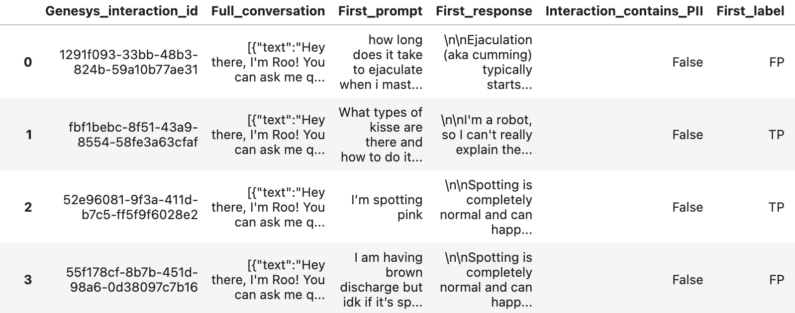

### Data Visualization
From our data exploration, we noticed that there was a significant class imbalance. There were many more instances of TP and FP than TN and FN.  
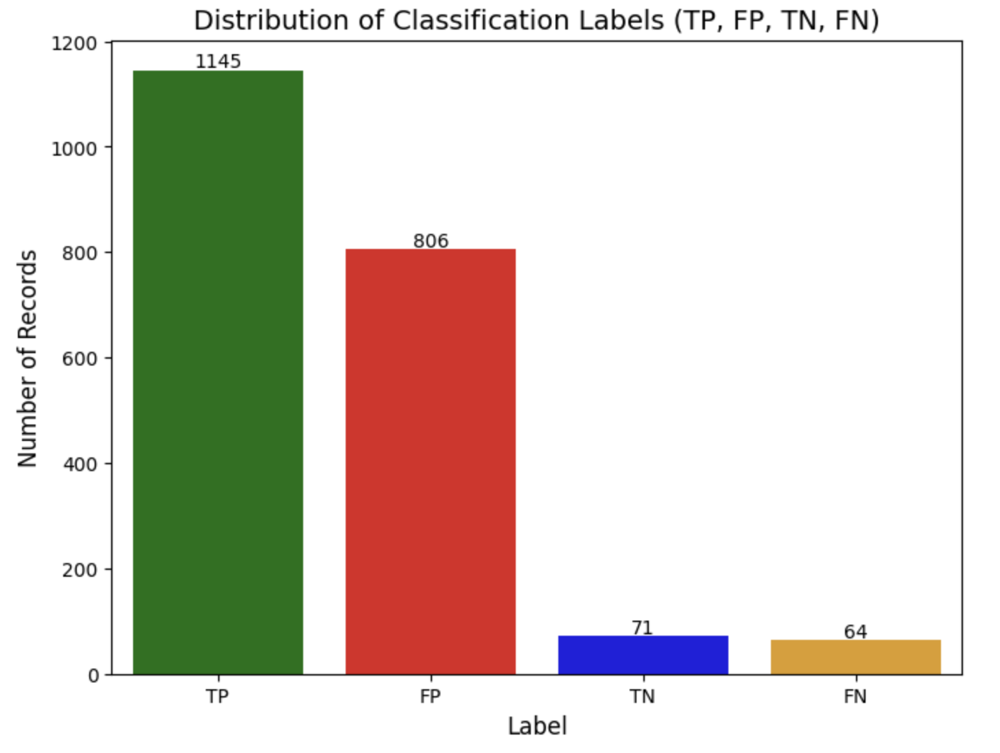

This imbalance can:
- Bias models toward majority classes.
- Cause poor learning on minority classes, as the model sees those instances much less often
- Make overall accuracy misleading without per-class metrics. The overall accuracy metric for all classes can be skewed by good performance on the large classes, hiding the poor performance on the smaller classes.

Because of this, evaluating performance using recall and F1 score was essential.

Next, we explored word clouds. We generated word clouds for different labels (e.g., TP vs. FN) to visualize common themes in user prompts and Roo's responses. These revealed patterns in question types and wording.

**Word Cloud for TP labeled prompts + responses:**  
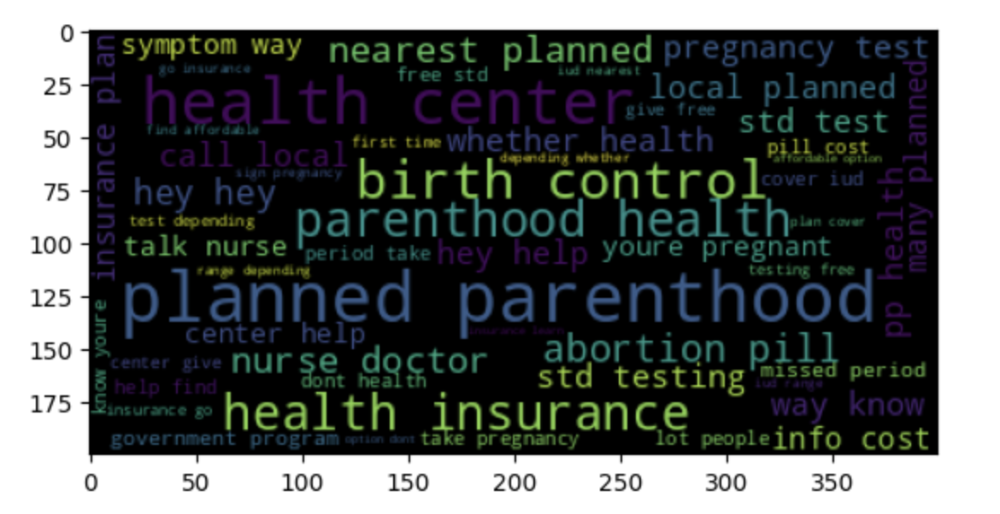

**Word Cloud for TN labeled prompts + responses:**  
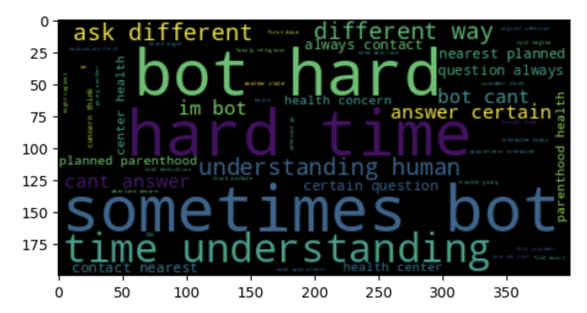

**Word Cloud for FP labeled prompts + responses:**  
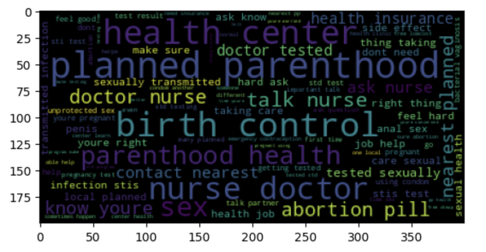

**Word Cloud for FN labeled prompts + responses:**  
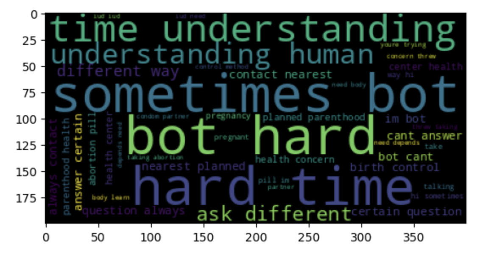

### Insights from our exploratory data analysis: 

The dataset is imbalanced, which can hinder model learning and lead to skewed metrics.
Accuracy alone is not sufficient; performance must be evaluated per class and with more relevant metrics.
Visual exploration via word clouds highlighted distinct prompt patterns across labels.

Based on these insights, we needed to find ways to mitigate class imbalance and evaluate model performance on a per-class basis. 

---

## 🧠 **Model Development**

### Models Evaluated
We chose a variety of classification models to test. We wanted some models that were more simple and models that were more complex to see how they would compare. 
- Logistic Regression
- Decision Tree
- Support Vector Classifier (SVC)
- Random Forest Decision Tree
- Gradient Boosted Decision Tree (GBDT)
  
### Feature selection, Training, and Hyperparameter tuning
We used the columns First prompt and First response as features, and First label as our label. Most of the other columns had multiple missing values and were therefore excluded from modeling. 

The dataset was split 70/30. 70 percent was used for the training and validation for Stratified K-Fold Cross Validation, and the final 30 percent was reserved for final testing. 

To address the small and imbalanced dataset, we used Stratified K-Fold Cross Validation during our model training. Using cross-validation helped our model see a variety of new training/validation data, and using k-fold stratification ensured that each fold had an even distribution of our 4 classes (TP, FP, TN, FN). 

The main evaluation metric we chose was recall for the FP class because we wanted to ensure that our evaluation model would capture when Roo was providing misinformation.

#### Logistic Regression Baseline Results  
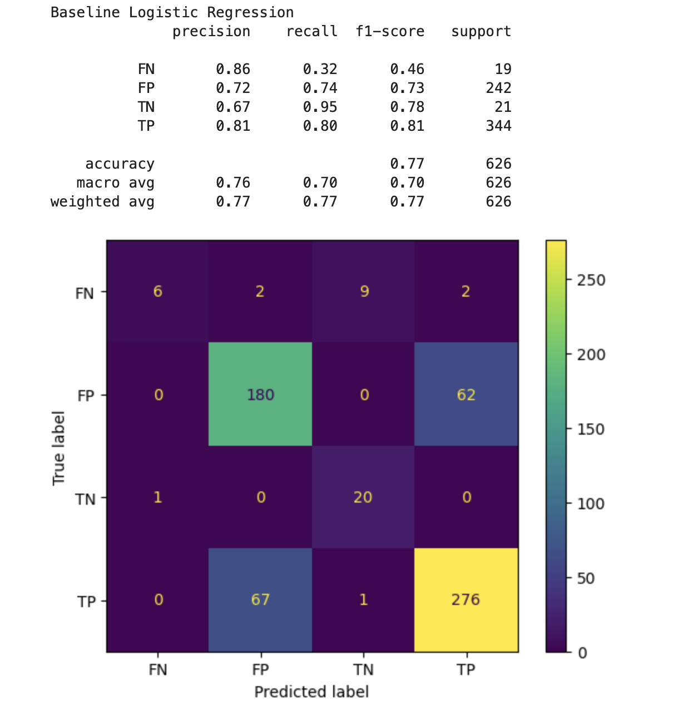

#### Decision Tree Baseline Results  
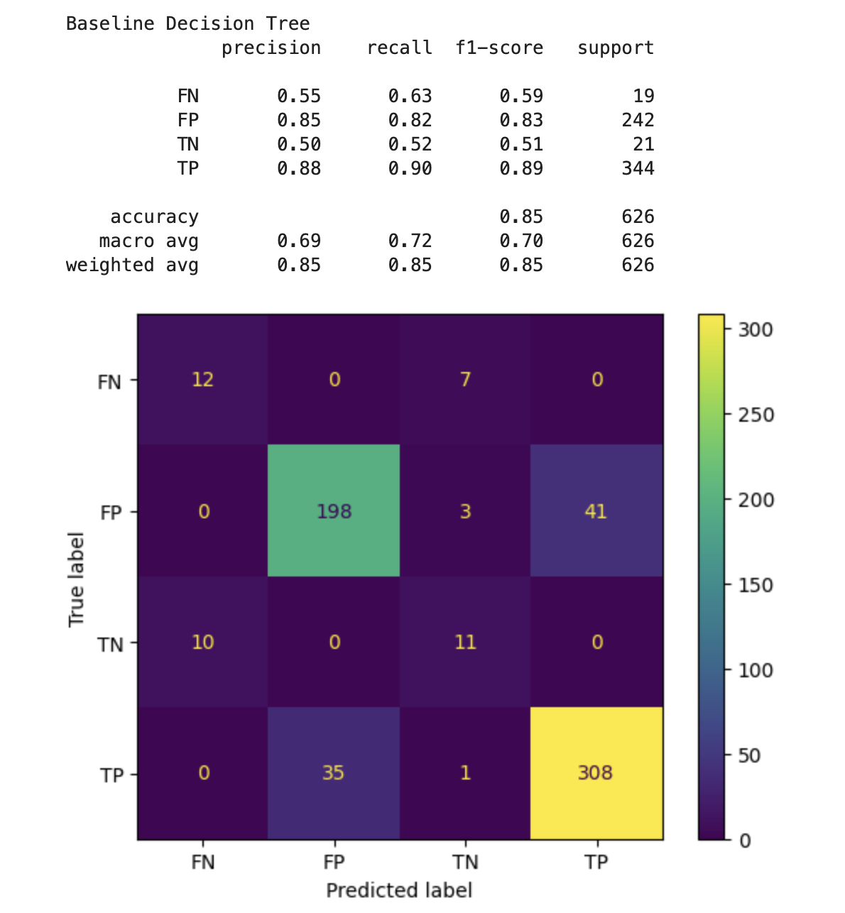

#### Random Forest Baseline Results  
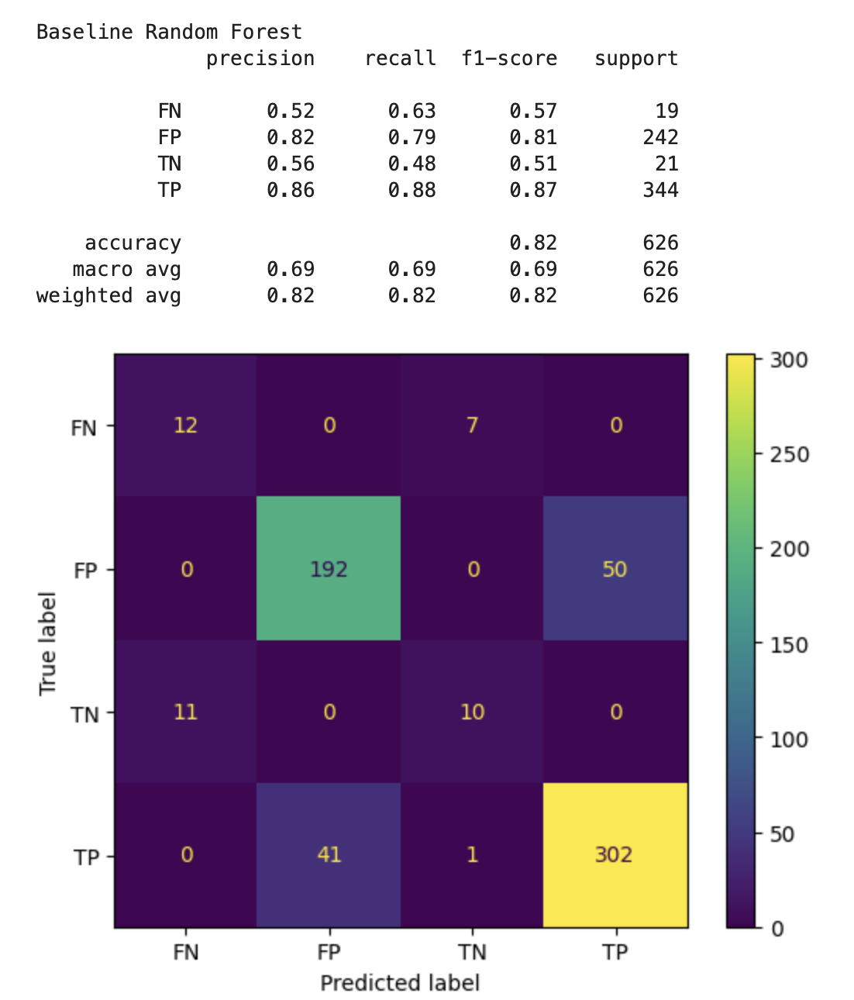

#### GBDT Baseline Results  
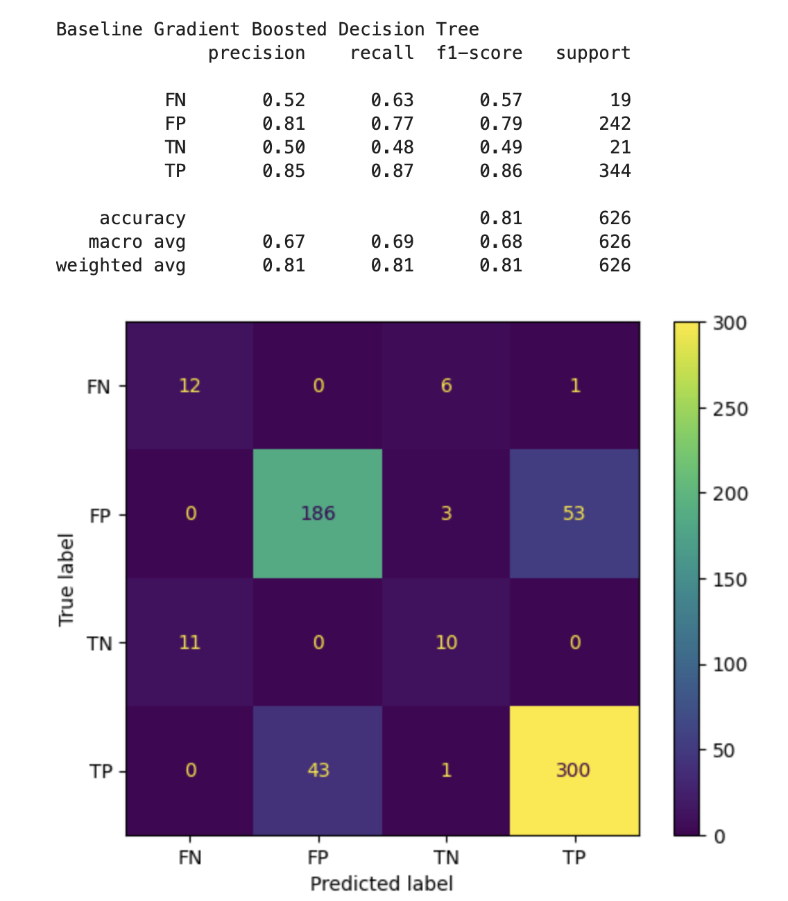

#### SVC Baseline Results  
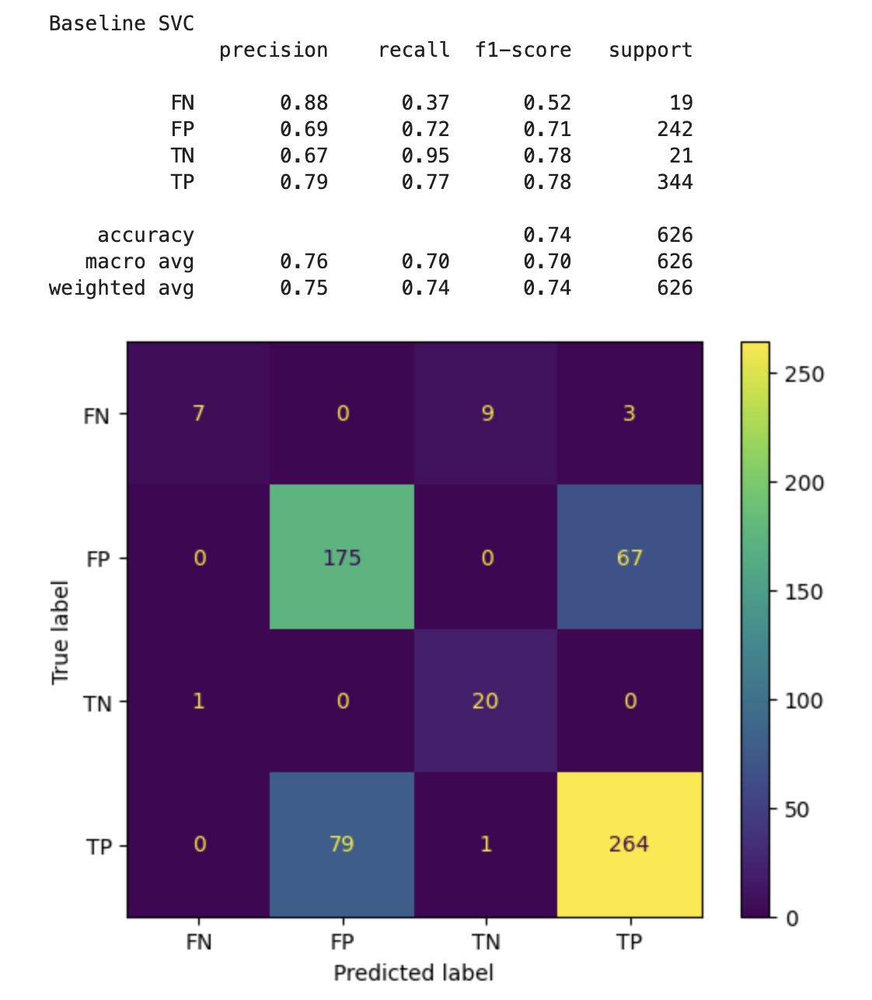

We used GridSearch to fine-tune models using k-fold cross-validation, prioritizing recall, f1, and accuracy metrics for scoring.

| **Model**                     | **Hyperparameters Tuned**                                                                                                         | **Notes**                                                                                                                                                                   |
|------------------------------|------------------------------------------------------------------------------------------------------------------------------------|-----------------------------------------------------------------------------------------------------------------------------------------------------------------------------|
| **Logistic Regression**      | TF-IDF n-grams, TF-IDF min_df, Logistic Regression C, penalty, solver                                                             | In addition to tuning classifier hyperparameters, we also tuned the TF-IDF vectorizer parameters.                                                                           |
| **Decision Tree**            | TF-IDF n-grams, TF-IDF min_df, min_samples_leaf, max_depth                                                                        | Similar to logistic regression, both the Decision Tree classifier and TF-IDF vectorizer hyperparameters were fine-tuned.                                                     |
| **SVC**                      | TF-IDF n-grams, TF-IDF min_df, kernel, C, class_weight                                                                            | We also experimented with Word2Vec + SVC, but results were weaker and training was more computationally expensive.                                                          |
| **Random Forest**            | Number of trees, max depth, feature sampling strategy, class weighting, random_state                                              | Used structured hyperparameter sweeps to evaluate tradeoffs across predefined parameter combinations.                                                                       |
| **Gradient Boosted Decision Tree** | Vectorizer max_features, learning rate, max depth, min_samples_leaf, L2 regularization, max_iterations, TF-IDF n-grams, random_state, early stopping | Tuned specifically to reduce overfitting and address class imbalance.                                                                                                       |

---

## 📈 **Results & Key Findings**
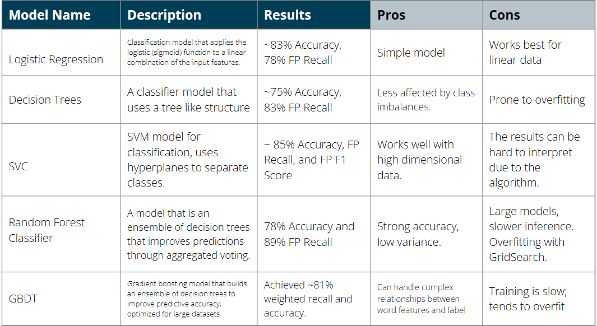

### Logistic Regression Final Results  
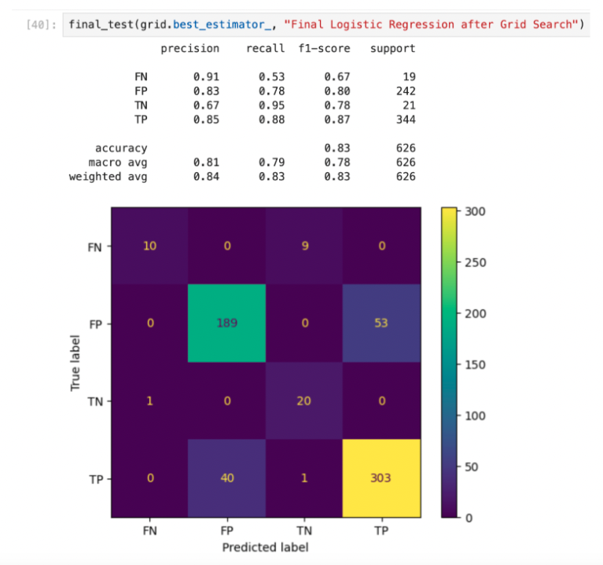

### Decision Tree Final Results  
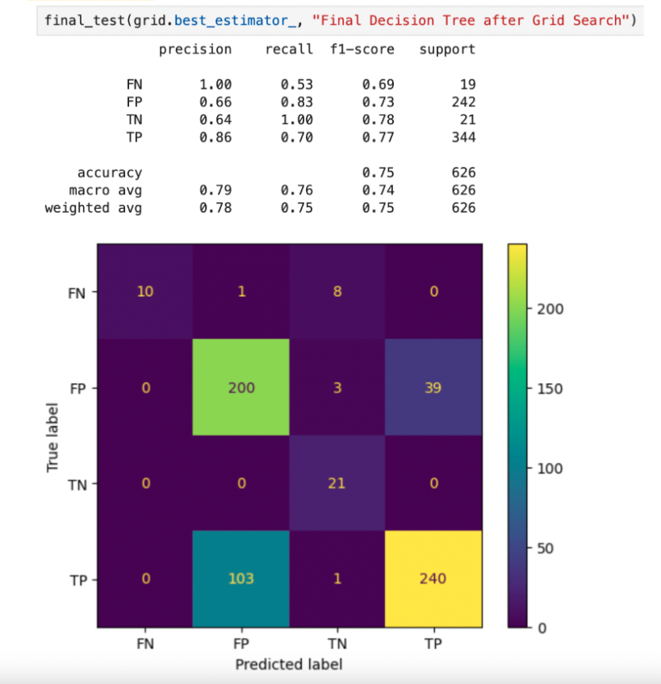

### Random Forest Final Results  
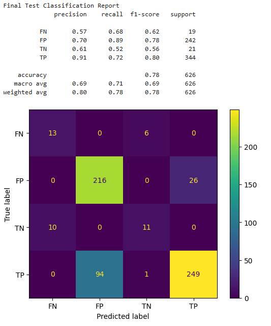

### GBDT Final Results  
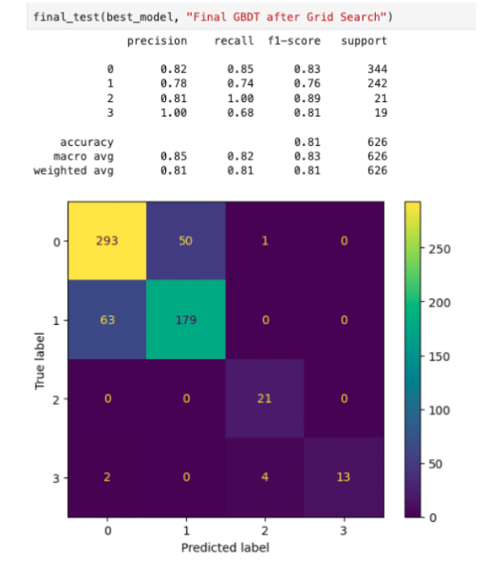

### SVC Final Results  
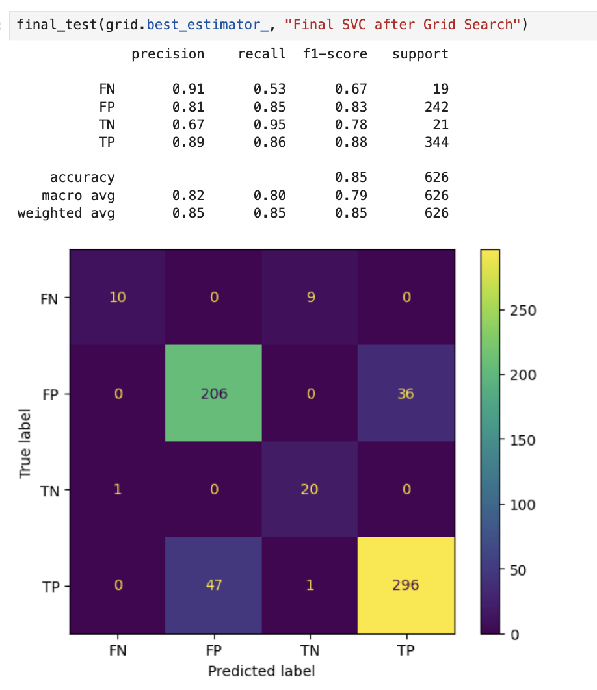

Our main metric was recall, but we also looked at accuracy and F1 score. 

Based on these metrics, we chose SVC as our final model because it performed the best overall across all metrics. Decision Trees is our second choice -- since it is a simpler model, it may perform better with more data and be less computationally expensive than SVC.

---

## 🚀 **Next Steps**

While the current models demonstrate strong performances in evaluating Roo’s conversational responses, there are still several opportunities to improve its accuracy/recall, robustness, and real-world impact.

### Model Limitations

- Limited labeled data restricts the model’s ability to generalize across rare or highly specific prompt types.
- It can struggle with subtle nuances in text, especially when user messages require more context to understand, or when the text contains multiple meanings.

### Improvements

With additional time and resources, we can:

- Collect more data to reduce class imbalance and strengthen the model’s ability to detect edge cases.
- Integrate advanced NLP embeddings (e.g., BERT or other transformer-based models) to capture deeper semantic relationships and improve classification accuracy.
- Explore neural network architectures such as LSTMs to better understand complex relationships within the text.
- Investigate the prompt characteristics that cause Roo to respond incorrectly, informing targeted model improvements.
- Engage with PPFA stakeholders -- including IT and healthcare teams -- to align the model with real operational needs, explore deployment strategies, and evaluate ethical and safety considerations.

---

## 📝 **License**
This project is licensed under the [Apache License version 2.0](https://www.apache.org/licenses/LICENSE-2.0).

---

## 📄 **References**

### Articles
- [Importing Google Sheets Data into Pandas](https://medium.com/@Bwhiz/step-by-step-guide-importing-google-sheets-data-into-pandas-ae2df899257f)

### Python Libraries
- Scikit-learn
- Pandas
- NumPy
- Matplotlib 

### Applications
- Jupyter Notebook
- Docker
- Notion
- Slack
- Google Drive

### Other Resources
- [Scikit-learn user guide](https://scikit-learn.org/stable/user_guide.html)
- Stack overflow

---

## 🙏 **Acknowledgements**

We thank **Michael O'Keefe** and **Rosette Diaz**, our Challenge Advisors, for their guidance and support throughout the project. We also thank **Ananya Devarakonda**, our AI Studio Coach, for consistent direction, technical insight, and encouragement.

